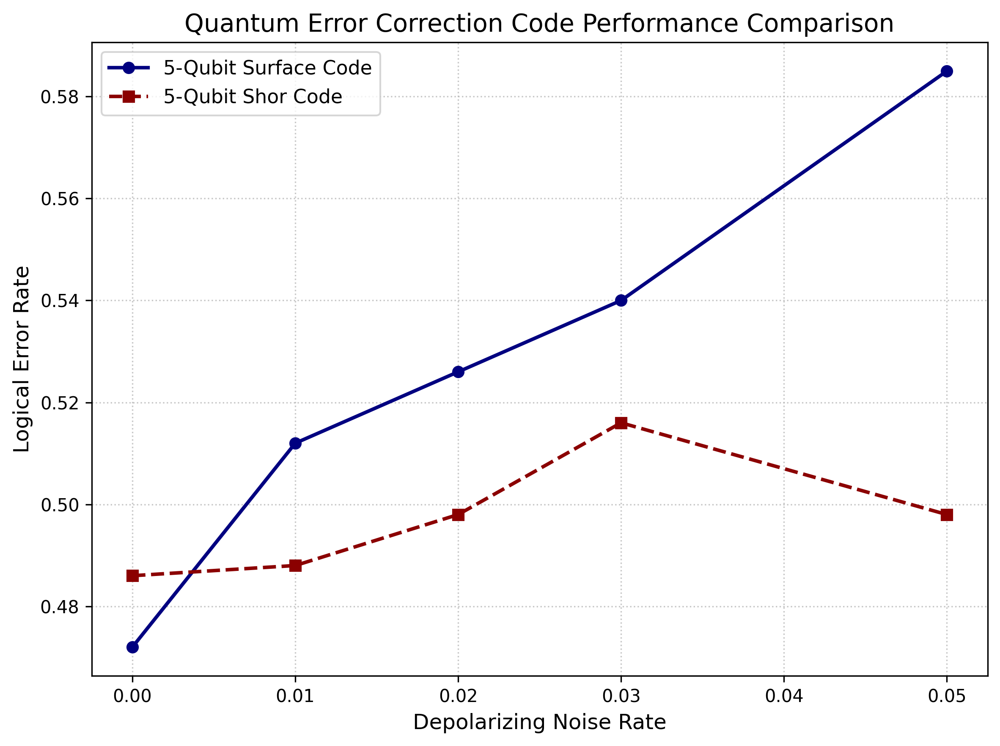

# Quantum Error Correction Simulation

## Motivation
Quantum error correction (QEC) is essential for building fault-tolerant quantum computers. This project simulates and compares the performance of two 5-qubit codes under realistic noise conditions.

## Project Overview
This project simulates the performance of two well-known 5-qubit error correction codes using Qiskit, under varying levels of depolarizing noise.

### Codes Simulated
- **5-Qubit Surface Code** - A topological error correction approach
- **5-Qubit Shor Code** - Peter Shor's pioneering quantum error correction code

### Noise Model
Depolarizing noise at rates of 0%, 1%, 2%, 3%, and 5% per gate.

### Key Deliverables
1. Python simulation scripts using Qiskit
2. Logical error rate plots vs. noise rate (`results/qec_plot.png`)
3. Comparative analysis in `REPORT.md`

## Results Preview


## Project Structure
```
QEC/
├── code/
│   ├── simulate_surface.py    # Surface code simulation
│   ├── simulate_shor.py       # Shor code simulation
│   └── plot_comparison.py     # Generate comparison plots
├── results/
│   └── qec_plot.png          # Error rate comparison plot
├── REPORT.md                 # Analysis and findings
├── requirements.txt          # Python dependencies  
├── proposal.pdf             # Project proposal
└── README.md               # This file
```

## Getting Started

### Prerequisites
- Python 3.8+
- Qiskit
- Matplotlib

### Installation
```bash
# Clone the repository
git clone https://github.com/samuel-gythia/QEC.git
cd QEC

# Create virtual environment
python -m venv venv
source venv/bin/activate  # On Windows: .\venv\Scripts\Activate.ps1

# Install dependencies
pip install -r requirements.txt
```

### Running Simulations
```bash
# Run surface code simulation
python code/simulate_surface.py

# Run Shor code simulation
python code/simulate_shor.py

# Generate comparison plots
python code/plot_comparison.py
```

## Results
The simulations show how logical error rates increase with physical gate noise for both codes. Detailed analysis can be found in `REPORT.md`.

## Notes
- This is a learning project for quantum error correction concepts
- Comments and debugging assistance provided by AI tools to ensure code clarity
- Future extensions could include stabilizer formalism and circuit optimization

## Contributing
Feedback and suggestions are welcome! This project serves as an introduction to quantum error correction for beginners.


